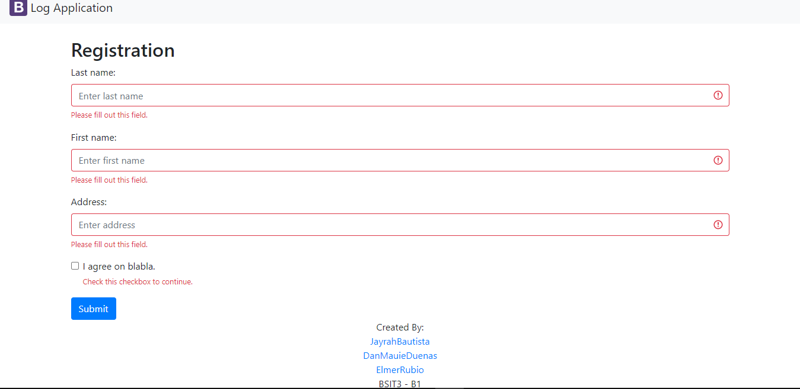
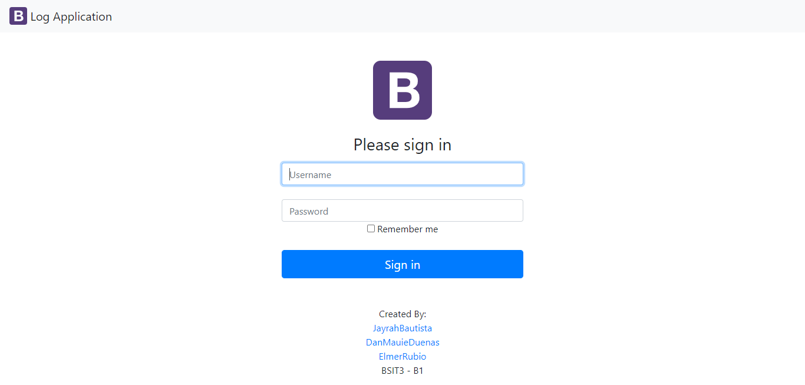
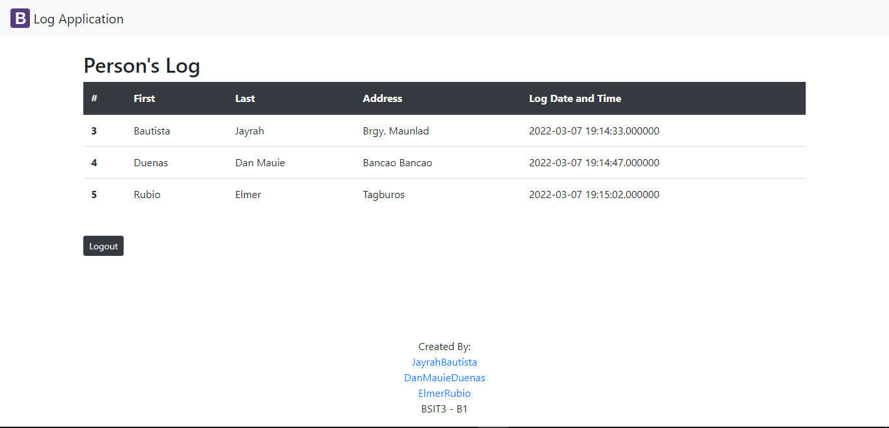

# Table of Contents
1. [Name](#font-colorblue📃inameifont)
2. [Description](#font-colorblue💁idescriptionifont)
3. [Pages of Log App](#font-colorblue👁️‍🗨️ipages-of-log-appifont)
4. [Installation](#font-colorblue🖥️iinstallationifont)
5. [Authors](#🦹font-colorblueuiauthorsiu)
***

## <font color='blue'>📃<i>Name</i></font>

## Log App
~ is a basic web application written in PHP and HTML that includes a database for storing the data entered by the user.

***

## <font color='blue'>💁<i>Description</i></font>

~ The logApp features a login function that only the website administrator may use, as well as a logout tool. 

~ Registration Form - The user will fill out the registration form and then submit it by clicking the submit button.

~ Only the Log App's administrator may access the lists of individuals who filled out the form and when they finished. 

***

## <font color='blue'>👁️‍🗨️<i>Pages of Log App</i></font>

# Registration Form



# Login



# List




***

## <font color='blue'>🖥️<i>Installation</i></font>

HOW TO INSTALL:

STEP 1: Using the git clone command in cmd, clone the remote repository to your PC.
```
$ git clone [URL of the repository]
```
STEP 2:  After the cloning is done, If you're using XAMPP, move the cloned repository to "C:XAMPPhtdocs," or to "C:WAMPwww," if you're using WAMPServer.

STEP 3: Start XAMPP or WampServer.

STEP 4: Open your browser and go to phpMyAdmin.
```
$ localhost/phpmyadmin
```

STEP 5: Import logApp's log a.sql database into phpmyadmin.

STEP 6: You may start exploring the LogApp by going to "http://localhost/logApp-scaling-octo/index.php".

<b>FINISH!</b>
***


## <font color='blue'>🦹<u><i>Authors</i></u></font>

### 👩‍💻[Bautista, Jayrah M. ](https://github.com/JayrahBautista)


### 👨‍💻[Duenas, Dan Mauie ](https://github.com/danmauie)


### 👨‍💻[Rubio,Elmer Jr. O.](https://github.com/elmerrubiojr)


***